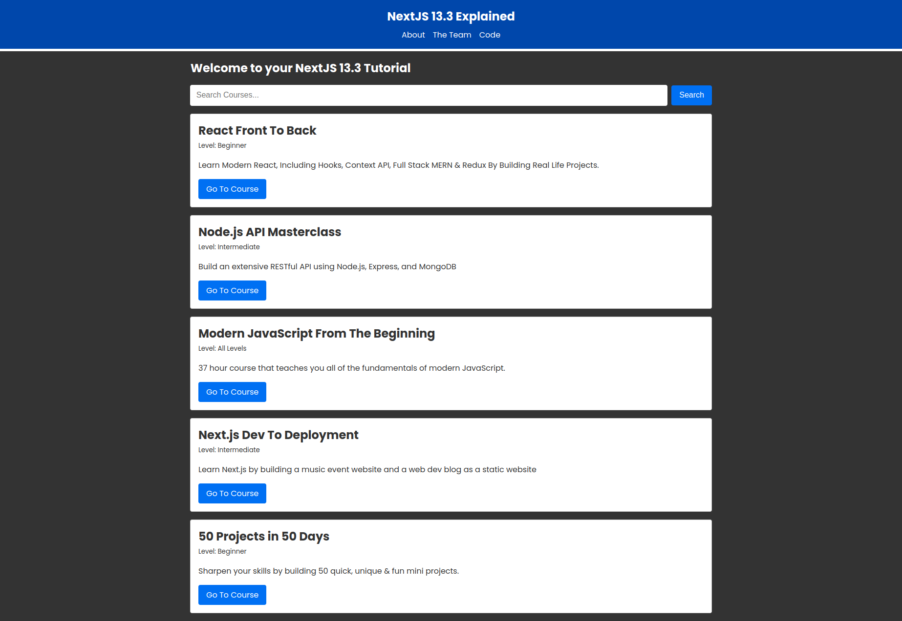

# Next JS 13.3 Explained

## Description
This is a NextJS 13 crash course provided by Traversy.  This app dives into the use of the new NextJS 13 folder structure that includes the new app directory, as well as the new component Metadata feature.  

## Summary
The purpose of this course was to learn the usage of routing with the new app folder structure for routing between the client and server sides (respectively) with api fetching and UI display, and the new approach to building a successful and powerful SEO with the use of the component nested metadata.  I used `npx-create-next-app@latest` with the experimental and tailwind optional features.  Tailwind, however, is not used throughout.  Instead, Traversy offered a pre-fab globals.css file for styling.  

As this app is a mock-up, there are certain features that are not operable, but the purpose of the course was acheived.  

You can find the deployed site here:
<!-- vercel site address goes here -->
for a run through of its functionality.
  

If you have a good understanding of React 18 and some history with NextJS, I HIGHLY RECOMMEND coding along with the [Next.js 13 Crash Course | App Directory, React Server Components & More](https://www.youtube.com/watch?v=Y6KDk5iyrYE).  

## Contact Information
[www.williamlowrimore.com](https://www.williamlowrimore.com) 

[www.wlowrimore@gmail.com](mailto:wlowrimore@gmail.com)

[Github Profile](https://www.github.com/wlowrimore)

<a href='https://www.linkedin.com/in/
william-lowrimore-21778310'>Linkedin Profile</a>
